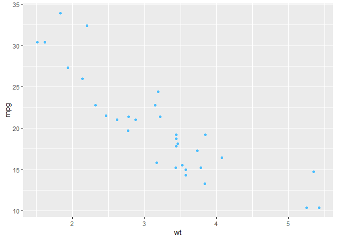

Data Visualization with ggplot2
================

    ## Warning: Expected 2 pieces. Missing pieces filled with `NA` in 150 rows
    ## [601, 602, 603, 604, 605, 606, 607, 608, 609, 610, 611, 612, 613, 614, 615,
    ## 616, 617, 618, 619, 620, ...].

1 Introduction
--------------

``` r
# Explore the mtcars data frame with str()
str(mtcars)
```

    ## 'data.frame':    32 obs. of  11 variables:
    ##  $ mpg : num  21 21 22.8 21.4 18.7 18.1 14.3 24.4 22.8 19.2 ...
    ##  $ cyl : num  6 6 4 6 8 6 8 4 4 6 ...
    ##  $ disp: num  160 160 108 258 360 ...
    ##  $ hp  : num  110 110 93 110 175 105 245 62 95 123 ...
    ##  $ drat: num  3.9 3.9 3.85 3.08 3.15 2.76 3.21 3.69 3.92 3.92 ...
    ##  $ wt  : num  2.62 2.88 2.32 3.21 3.44 ...
    ##  $ qsec: num  16.5 17 18.6 19.4 17 ...
    ##  $ vs  : num  0 0 1 1 0 1 0 1 1 1 ...
    ##  $ am  : num  1 1 1 0 0 0 0 0 0 0 ...
    ##  $ gear: num  4 4 4 3 3 3 3 4 4 4 ...
    ##  $ carb: num  4 4 1 1 2 1 4 2 2 4 ...

``` r
# Execute the following command
ggplot(mtcars, aes(x = cyl, y = mpg)) +
  geom_point()
```


``` r
# Change the command below so that cyl is treated as factor
ggplot(mtcars, aes(x = factor(cyl), y = mpg)) +
  geom_point()
```


``` r
## Adding layers
ggplot(mtcars, aes(x = factor(cyl), y = mpg, color=disp)) +
  geom_point()
```


``` r
ggplot(mtcars, aes(x = factor(cyl), y = mpg, size=disp)) +
  geom_point()
```


``` r
# Add geom_point() and geom_smooth() with +
ggplot(diamonds, aes(x = carat, y = price)) + geom_point() + geom_smooth()
```

    ## `geom_smooth()` using method = 'gam' and formula 'y ~ s(x, bs = "cs")'


``` r
# Create the object containing the data and aes layers: dia_plot
dia_plot <- ggplot(diamonds, aes(x = carat, y = price))

# Add a geom layer with + and geom_point()
dia_plot + geom_point()
```


``` r
# Add the same geom layer, but with aes() inside
dia_plot + geom_point(aes(color = clarity))
```


``` r
# 1 - The dia_plot object has been created for you
dia_plot <- ggplot(diamonds, aes(x = carat, y = price))

# 2 - Expand dia_plot by adding geom_point() with alpha set to 0.2
dia_plot <- dia_plot + geom_point(alpha=0.2)

# 3 - Plot dia_plot with additional geom_smooth() with se set to FALSE
dia_plot + geom_smooth(se = FALSE)
```

    ## `geom_smooth()` using method = 'gam' and formula 'y ~ s(x, bs = "cs")'


``` r
# 4 - Copy the command from above and add aes() with the correct mapping to geom_smooth()
dia_plot + geom_smooth(aes(color = clarity), se = FALSE)
```

    ## `geom_smooth()` using method = 'gam' and formula 'y ~ s(x, bs = "cs")'


2 Data
------

``` r
# In this exercise you'll recreate the base package plot in ggplot2.

# Plot 2: include the lines of the linear models, per cyl
ggplot(mtcars, aes(x = wt, y = mpg, col = cyl)) +
  geom_point() + # Copy from Plot 1
  geom_smooth(method=lm, se=FALSE) 
```


``` r
# Convert cyl to factor (don't need to change)
mtcars$cyl <- as.factor(mtcars$cyl)

# Example from base R (don't need to change)
plot(mtcars$wt, mtcars$mpg, col = mtcars$cyl)
abline(lm(mpg ~ wt, data = mtcars), lty = 2)
lapply(mtcars$cyl, function(x) {
  abline(lm(mpg ~ wt, mtcars, subset = (cyl == x)), col = x)
  })
```

    ## [[1]]
    ## NULL
    ## 
    ## [[2]]
    ## NULL
    ## 
    ## [[3]]
    ## NULL
    ## 
    ## [[4]]
    ## NULL
    ## 
    ## [[5]]
    ## NULL
    ## 
    ## [[6]]
    ## NULL
    ## 
    ## [[7]]
    ## NULL
    ## 
    ## [[8]]
    ## NULL
    ## 
    ## [[9]]
    ## NULL
    ## 
    ## [[10]]
    ## NULL
    ## 
    ## [[11]]
    ## NULL
    ## 
    ## [[12]]
    ## NULL
    ## 
    ## [[13]]
    ## NULL
    ## 
    ## [[14]]
    ## NULL
    ## 
    ## [[15]]
    ## NULL
    ## 
    ## [[16]]
    ## NULL
    ## 
    ## [[17]]
    ## NULL
    ## 
    ## [[18]]
    ## NULL
    ## 
    ## [[19]]
    ## NULL
    ## 
    ## [[20]]
    ## NULL
    ## 
    ## [[21]]
    ## NULL
    ## 
    ## [[22]]
    ## NULL
    ## 
    ## [[23]]
    ## NULL
    ## 
    ## [[24]]
    ## NULL
    ## 
    ## [[25]]
    ## NULL
    ## 
    ## [[26]]
    ## NULL
    ## 
    ## [[27]]
    ## NULL
    ## 
    ## [[28]]
    ## NULL
    ## 
    ## [[29]]
    ## NULL
    ## 
    ## [[30]]
    ## NULL
    ## 
    ## [[31]]
    ## NULL
    ## 
    ## [[32]]
    ## NULL

``` r
legend(x = 5, y = 33, legend = levels(mtcars$cyl),
       col = 1:3, pch = 1, bty = "n")
```


``` r
# Plot 1: add geom_point() to this command to create a scatter plot
ggplot(mtcars, aes(x = wt, y = mpg, col = cyl)) + geom_point()
```


``` r
# Fill in using instructions Plot 1

# Plot 2: include the lines of the linear models, per cyl
ggplot(mtcars, aes(x = wt, y = mpg, col = cyl)) +
  geom_point() + # Copy from Plot 1
  geom_smooth(method=lm, se=FALSE)   # Fill in using instructions Plot 2
```


``` r
# Plot 3: include a lm for the entire dataset in its whole
ggplot(mtcars, aes(x = wt, y = mpg, col = cyl)) +
  geom_point() + # Copy from Plot 2
  geom_smooth(method=lm, se=FALSE) + # Copy from Plot 2
  geom_smooth(method=lm, se=FALSE, linetype=2, aes(group=1))   
```


``` r
# Consider the structure of iris, iris.wide and iris.tidy (in that order)
str(iris)
```

    ## 'data.frame':    150 obs. of  6 variables:
    ##  $ Sepal.Length: num  5.1 4.9 4.7 4.6 5 5.4 4.6 5 4.4 4.9 ...
    ##  $ Sepal.Width : num  3.5 3 3.2 3.1 3.6 3.9 3.4 3.4 2.9 3.1 ...
    ##  $ Petal.Length: num  1.4 1.4 1.3 1.5 1.4 1.7 1.4 1.5 1.4 1.5 ...
    ##  $ Petal.Width : num  0.2 0.2 0.2 0.2 0.2 0.4 0.3 0.2 0.2 0.1 ...
    ##  $ Species     : Factor w/ 3 levels "setosa","versicolor",..: 1 1 1 1 1 1 1 1 1 1 ...
    ##  $ Flower      : int  1 2 3 4 5 6 7 8 9 10 ...

``` r
str(iris.wide)
```

    ## 'data.frame':    300 obs. of  5 variables:
    ##  $ Species: Factor w/ 3 levels "setosa","versicolor",..: 1 1 1 1 1 1 1 1 1 1 ...
    ##  $ Flower : int  1 1 2 2 3 3 4 4 5 5 ...
    ##  $ Part   : chr  "Petal" "Sepal" "Petal" "Sepal" ...
    ##  $ Length : num  1.4 5.1 1.4 4.9 1.3 4.7 1.5 4.6 1.4 5 ...
    ##  $ Width  : num  0.2 3.5 0.2 3 0.2 3.2 0.2 3.1 0.2 3.6 ...

``` r
str(iris.tidy)
```

    ## 'data.frame':    750 obs. of  4 variables:
    ##  $ Species: Factor w/ 3 levels "setosa","versicolor",..: 1 1 1 1 1 1 1 1 1 1 ...
    ##  $ Part   : chr  "Sepal" "Sepal" "Sepal" "Sepal" ...
    ##  $ Measure: chr  "Length" "Length" "Length" "Length" ...
    ##  $ Value  : num  5.1 4.9 4.7 4.6 5 5.4 4.6 5 4.4 4.9 ...

``` r
# Think about which dataset you would use to get the plot shown right
# Fill in the ___ to produce the plot given to the right
ggplot(iris.tidy, aes(x = Species, y = Value, col = Part)) +
  geom_jitter() +
  facet_grid(. ~ Measure)
```


``` r
# Fill in the ___ to produce to the correct iris.tidy dataset
iris.tidy <- iris %>%
  gather(key, Value, -Species) %>%
  separate(key, c("Part", "Measure"), "\\.")
```

    ## Warning: Expected 2 pieces. Missing pieces filled with `NA` in 150 rows
    ## [601, 602, 603, 604, 605, 606, 607, 608, 609, 610, 611, 612, 613, 614, 615,
    ## 616, 617, 618, 619, 620, ...].

``` r
# Fill in the ___ to produce the plot given to the right
ggplot(iris.wide, aes(x = Length, y = Width, color = Part)) +
  geom_jitter() +
  facet_grid(. ~ Species)
```


3 Aesthetics
------------

### 3.1 All about aesthetics

``` r
# 1 - Map mpg to x and cyl to y
ggplot(mtcars, aes(x=mpg, y=cyl)) +
  geom_point()
```


``` r
# 2 - Reverse: Map cyl to x and mpg to y
ggplot(mtcars, aes(x=cyl, y=mpg)) +
  geom_point()
```


``` r
# 3 - Map wt to x, mpg to y and cyl to col
ggplot(mtcars, aes(x=wt, y=mpg, col=cyl)) +
  geom_point()
```


``` r
# 4 - Change shape and size of the points in the above plot
ggplot(mtcars, aes(x=wt, y=mpg, col=cyl)) +
  geom_point(shape=1, size=4)
```


``` r
# am and cyl are factors, wt is numeric
class(mtcars$am)
```

    ## [1] "numeric"

``` r
class(mtcars$cyl)
```

    ## [1] "factor"

``` r
class(mtcars$wt)
```

    ## [1] "numeric"

``` r
# From the previous exercise
ggplot(mtcars, aes(x = wt, y = mpg, col = cyl)) +
  geom_point(shape = 1, size = 4)
```


``` r
# 1 - Map cyl to fill
ggplot(mtcars, aes(x = wt, y = mpg, fill = cyl)) +
  geom_point(shape = 1, size = 4)
```


``` r
# 2 - Change shape and alpha of the points in the above plot
ggplot(mtcars, aes(x = wt, y = mpg, fill = cyl)) +
  geom_point(shape = 21, size = 4, alpha=0.6)
```


``` r
# 3 - Map am to col in the above plot
ggplot(mtcars, aes(x = wt, y = mpg, col = am, fill=cyl)) +
  geom_point(shape = 21, size = 4, alpha=0.6)
```


### 3.2 All about attributes

``` r
# Define a hexadecimal color
my_color <- "#4ABEFF"

# Draw a scatter plot with color *aesthetic*
ggplot(mtcars, aes(x=wt, y=mpg, color=cyl)) + geom_point()
```


``` r
# Same, but set color *attribute* in geom layer 
ggplot(mtcars, aes(x=wt, y=mpg, color=cyl)) + geom_point(color=my_color)
```



``` r
# Set the fill aesthetic; color, size and shape attributes
ggplot(mtcars, aes(x=wt, y=mpg, fill=cyl)) + geom_point(size=10, shape=23, color=my_color)
```


``` r
# Expand to draw points with alpha 0.5
ggplot(mtcars, aes(x = wt, y = mpg, fill = cyl)) + geom_point(alpha=0.5)
```


``` r
# Expand to draw points with shape 24 and color yellow
#[This is so bad to read...]
ggplot(mtcars, aes(x = wt, y = mpg, fill=cyl)) + geom_point(shape=24, color="yellow")
```


``` r
# Expand to draw text with label rownames(mtcars) and color red
#[This one too...]
ggplot(mtcars, aes(x = wt, y = mpg, fill = cyl)) + 
geom_text(label=rownames(mtcars), color='red')
```


``` r
# Map mpg onto x, qsec onto y and factor(cyl) onto col
ggplot(mtcars, aes(x=mpg, y=qsec, color=factor(cyl))) + geom_point()
```


``` r
# Add mapping: factor(am) onto shape
ggplot(mtcars, aes(x=mpg, y=qsec, color=factor(cyl), shape=factor(am))) + geom_point()
```


``` r
# Add mapping: (hp/wt) onto size
ggplot(mtcars, aes(x=mpg, y=qsec, color=factor(cyl), shape=factor(am), size=(hp/wt) )) + geom_point()
```


### 3.3 Tweaking scales

``` r
cyl.am <- ggplot(mtcars, aes(x = factor(cyl), fill = factor(am)))

cyl.am + 
  geom_bar(position="stack")
```


``` r
# Fill - show proportion
cyl.am + 
  geom_bar(position = "fill")  
```


``` r
# The base layer, cyl.am, is available for you
# Add geom (position = "stack" by default)
cyl.am + 
  geom_bar()
```


``` r
# Fill - show proportion
cyl.am + 
  geom_bar(position = "fill")  
```


``` r
# Dodging - principles of similarity and proximity
cyl.am +
  geom_bar(position = "dodge") 
```


``` r
# Clean up the axes with scale_ functions
val = c("#E41A1C", "#377EB8")
lab = c("Manual", "Automatic")
cyl.am +
  geom_bar(position = "dodge") +
  scale_x_discrete("Cylinders") + 
  scale_y_continuous("Number") +
  scale_fill_manual("Transmission", 
                    values = val,
                    labels = lab) 
```


``` r
### UNIVARIATE PLOTS 
# 1 - Create jittered plot of mtcars, mpg onto x, 0 onto y
ggplot(mtcars, aes(x = mpg, y = 0)) +
  geom_jitter()
```


``` r
# 2 - Add function to change y axis limits
ggplot(mtcars, aes(x = mpg, y = 0)) +
  geom_jitter() + scale_y_continuous(limits=c(-2,2))
```


``` r
### Dealing with overplotting
# Basic scatter plot: wt on x-axis and mpg on y-axis; map cyl to col
ggplot(mtcars, aes(x=wt, y=mpg, color=cyl)) + geom_point(size=4)
```


``` r
# Hollow circles - an improvement
ggplot(mtcars, aes(x=wt, y=mpg, color=cyl)) + geom_point(size=4, shape=1)
```


``` r
# Add transparency - very nice
ggplot(mtcars, aes(x=wt, y=mpg, color=cyl)) + geom_point(size=4, shape=1, alpha=0.6)
```


``` r
# Scatter plot: carat (x), price (y), clarity (color)
ggplot(diamonds, aes(x=carat, y=price, color=clarity)) + geom_point()
```


``` r
# Adjust for overplotting
ggplot(diamonds, aes(x=carat, y=price, color=clarity)) + geom_point(alpha=0.5)
```


``` r
# Scatter plot: clarity (x), carat (y), price (color)
ggplot(diamonds, aes(x=clarity, y=carat, color=price)) + geom_point(alpha=0.5)
```


``` r
# Dot plot with jittering
ggplot(diamonds, aes(x=clarity, y=carat, color=price)) + geom_point(alpha=0.5, position="jitter")
```


