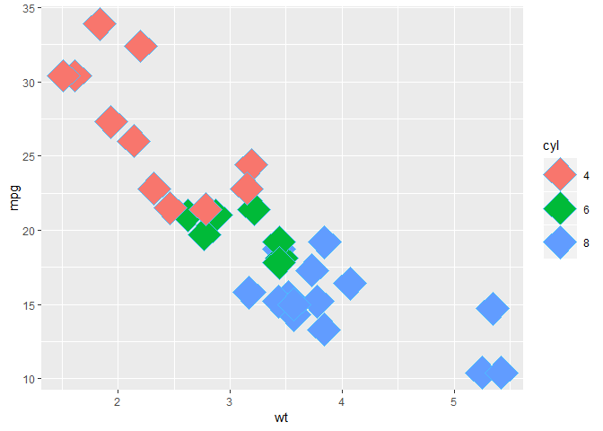

Data Visualization with ggplot2
================

1 Introduction
--------------

``` r
# Explore the mtcars data frame with str()
str(mtcars)
```

    ## 'data.frame':    32 obs. of  11 variables:
    ##  $ mpg : num  21 21 22.8 21.4 18.7 18.1 14.3 24.4 22.8 19.2 ...
    ##  $ cyl : num  6 6 4 6 8 6 8 4 4 6 ...
    ##  $ disp: num  160 160 108 258 360 ...
    ##  $ hp  : num  110 110 93 110 175 105 245 62 95 123 ...
    ##  $ drat: num  3.9 3.9 3.85 3.08 3.15 2.76 3.21 3.69 3.92 3.92 ...
    ##  $ wt  : num  2.62 2.88 2.32 3.21 3.44 ...
    ##  $ qsec: num  16.5 17 18.6 19.4 17 ...
    ##  $ vs  : num  0 0 1 1 0 1 0 1 1 1 ...
    ##  $ am  : num  1 1 1 0 0 0 0 0 0 0 ...
    ##  $ gear: num  4 4 4 3 3 3 3 4 4 4 ...
    ##  $ carb: num  4 4 1 1 2 1 4 2 2 4 ...

``` r
# Execute the following command
ggplot(mtcars, aes(x = cyl, y = mpg)) +
  geom_point()
```


``` r
# Change the command below so that cyl is treated as factor
ggplot(mtcars, aes(x = factor(cyl), y = mpg)) +
  geom_point()
```


``` r
## Adding layers
ggplot(mtcars, aes(x = factor(cyl), y = mpg, color=disp)) +
  geom_point()
```



``` r
ggplot(mtcars, aes(x = factor(cyl), y = mpg, size=disp)) +
  geom_point()
```


``` r
# Add geom_point() and geom_smooth() with +
ggplot(diamonds, aes(x = carat, y = price)) + geom_point() + geom_smooth()
```

    ## `geom_smooth()` using method = 'gam' and formula 'y ~ s(x, bs = "cs")'


``` r
# Create the object containing the data and aes layers: dia_plot
dia_plot <- ggplot(diamonds, aes(x = carat, y = price))

# Add a geom layer with + and geom_point()
dia_plot + geom_point()
```


``` r
# Add the same geom layer, but with aes() inside
dia_plot + geom_point(aes(color = clarity))
```


``` r
# 1 - The dia_plot object has been created for you
dia_plot <- ggplot(diamonds, aes(x = carat, y = price))

# 2 - Expand dia_plot by adding geom_point() with alpha set to 0.2
dia_plot <- dia_plot + geom_point(alpha=0.2)

# 3 - Plot dia_plot with additional geom_smooth() with se set to FALSE
dia_plot + geom_smooth(se = FALSE)
```

    ## `geom_smooth()` using method = 'gam' and formula 'y ~ s(x, bs = "cs")'


``` r
# 4 - Copy the command from above and add aes() with the correct mapping to geom_smooth()
dia_plot + geom_smooth(aes(color = clarity), se = FALSE)
```

    ## `geom_smooth()` using method = 'gam' and formula 'y ~ s(x, bs = "cs")'


2 Data
------

``` r
# In this exercise you'll recreate the base package plot in ggplot2.

# Convert cyl to factor (don't need to change)
mtcars$cyl <- as.factor(mtcars$cyl)

# Example from base R (don't need to change)
plot(mtcars$wt, mtcars$mpg, col = mtcars$cyl)
abline(lm(mpg ~ wt, data = mtcars), lty = 2)
lapply(mtcars$cyl, function(x) {
  abline(lm(mpg ~ wt, mtcars, subset = (cyl == x)), col = x)
  })
```

    ## [[1]]
    ## NULL
    ## 
    ## [[2]]
    ## NULL
    ## 
    ## [[3]]
    ## NULL
    ## 
    ## [[4]]
    ## NULL
    ## 
    ## [[5]]
    ## NULL
    ## 
    ## [[6]]
    ## NULL
    ## 
    ## [[7]]
    ## NULL
    ## 
    ## [[8]]
    ## NULL
    ## 
    ## [[9]]
    ## NULL
    ## 
    ## [[10]]
    ## NULL
    ## 
    ## [[11]]
    ## NULL
    ## 
    ## [[12]]
    ## NULL
    ## 
    ## [[13]]
    ## NULL
    ## 
    ## [[14]]
    ## NULL
    ## 
    ## [[15]]
    ## NULL
    ## 
    ## [[16]]
    ## NULL
    ## 
    ## [[17]]
    ## NULL
    ## 
    ## [[18]]
    ## NULL
    ## 
    ## [[19]]
    ## NULL
    ## 
    ## [[20]]
    ## NULL
    ## 
    ## [[21]]
    ## NULL
    ## 
    ## [[22]]
    ## NULL
    ## 
    ## [[23]]
    ## NULL
    ## 
    ## [[24]]
    ## NULL
    ## 
    ## [[25]]
    ## NULL
    ## 
    ## [[26]]
    ## NULL
    ## 
    ## [[27]]
    ## NULL
    ## 
    ## [[28]]
    ## NULL
    ## 
    ## [[29]]
    ## NULL
    ## 
    ## [[30]]
    ## NULL
    ## 
    ## [[31]]
    ## NULL
    ## 
    ## [[32]]
    ## NULL

``` r
legend(x = 5, y = 33, legend = levels(mtcars$cyl),
       col = 1:3, pch = 1, bty = "n")
```


