Multivar Stat Distr in R
================
alexmerk
November 30, 2018

``` r
#install.packages("pacman", repos="http://cran.us.r-project.org")
library(pacman)
pacman::p_load(ggplot2,
               GGally,
               mvtnorm,
               sn,
               MVN,
               scatterplot3d,
               factoextra,
               corrplot)
```

1 Reading and plotting multivariate data
----------------------------------------

### 1.1 Reading MV data

``` r
# Reading the data sets from the URL (a Github repo)
ais <- read.csv(file="http://raw.githubusercontent.com/alexmerk/xcourse/master/mva/ais.csv")
wine <- read.csv(file="http://raw.githubusercontent.com/alexmerk/xcourse/master/mva/wine.csv")

# Change the wine type variable to a factor
wine$Type <- as.factor(wine$Type)
```

### 1.2 Mean vector and variance-covariance matrix

#### Several commands to calculate means (also by group)

``` r
# Calculate the mean of the Alcohol, Malic, Ash, and Alcalinity variables 
colMeans(wine[,2:5])
```

    ##    Alcohol      Malic        Ash Alcalinity 
    ##  13.000618   2.336348   2.366517  19.494944

``` r
# Calculate the mean of the variables by wine type
by(wine[,2:5], INDICES=wine$Type, FUN=colMeans)
```

    ## wine$Type: 1
    ##    Alcohol      Malic        Ash Alcalinity 
    ##  13.744746   2.010678   2.455593  17.037288 
    ## -------------------------------------------------------- 
    ## wine$Type: 2
    ##    Alcohol      Malic        Ash Alcalinity 
    ##  12.278732   1.932676   2.244789  20.238028 
    ## -------------------------------------------------------- 
    ## wine$Type: 3
    ##    Alcohol      Malic        Ash Alcalinity 
    ##  13.153750   3.333750   2.437083  21.416667

``` r
# Or using the tidyverse/purrr
#wine %>% map_dbl(mean, na.rm=TRUE)
```

#### Variance-covariance and correlation matrices

``` r
# Calculate the variance-covariance matrix of the variables Alcohol, Malic, Ash, Alcalinity
var.wine <- var(wine[,2:5])

# Round the matrix values to two decimal places 
round(var.wine, 2)
```

    ##            Alcohol Malic  Ash Alcalinity
    ## Alcohol       0.66  0.09 0.05      -0.84
    ## Malic         0.09  1.25 0.05       1.08
    ## Ash           0.05  0.05 0.08       0.41
    ## Alcalinity   -0.84  1.08 0.41      11.15

``` r
# Calculate the correlation matrix 
cor.wine <- cor(wine[,2:5])

# Round the matrix to two decimal places 
round(cor.wine,2)
```

    ##            Alcohol Malic  Ash Alcalinity
    ## Alcohol       1.00  0.09 0.21      -0.31
    ## Malic         0.09  1.00 0.16       0.29
    ## Ash           0.21  0.16 1.00       0.44
    ## Alcalinity   -0.31  0.29 0.44       1.00

``` r
# Plot the correlations 
corrplot(cor.wine, method = "ellipse")
```

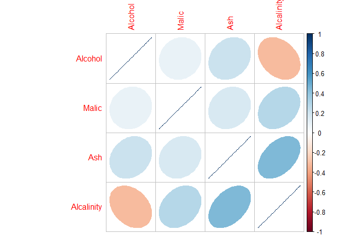

### 1.3 Plotting MV data

#### Using R base & ggplot2 graphics

``` r
# Scatter plot matrix using the base R plot function
pairs(wine[,2:5])
```

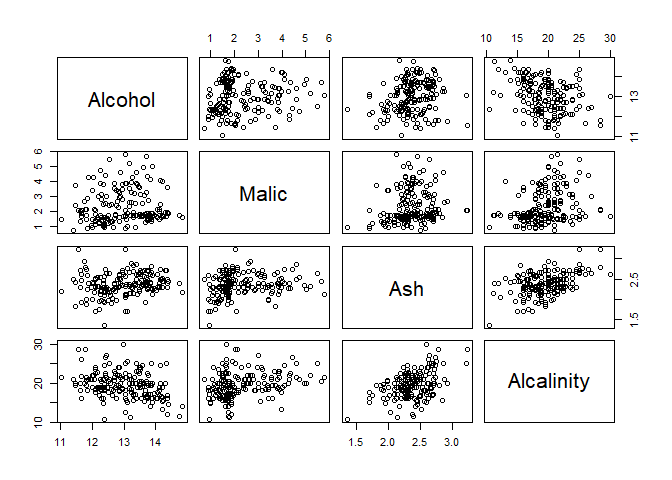

``` r
# Produce a matrix of plots for the first four variables 
wine.gg <- ggpairs(wine, columns=2:5, mapping=aes(color=Type))
wine.gg
```

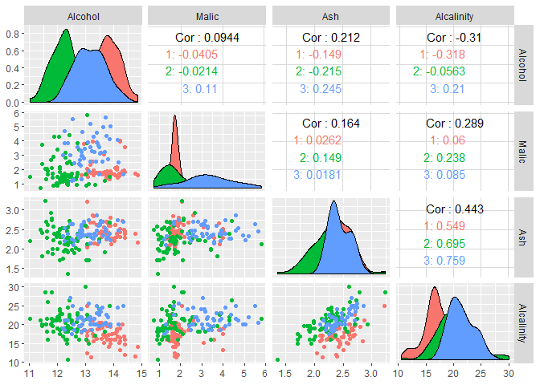

``` r
# Plot three variables 
scatterplot3d(wine[, c(2,3,5)], color=wine$Type)
```

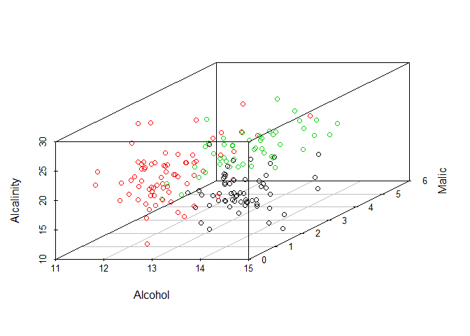

2 Multivariate Normal Distribution
----------------------------------

### 2.1 MND: Definition and sampling

#### Samples from MVND=MND

``` r
# Given following parameters:
mu.sim <- c(2,-2)
sigma.sim <- matrix(c(9,5,5,4), nrow=2)

# Generate 100 bivariate normal samples
multnorm.sample <- rmvnorm(100, mean=mu.sim, sigma=sigma.sim)

# View the first 6 samples
head(multnorm.sample)
```

    ##           [,1]       [,2]
    ## [1,] -3.083096 -3.8271691
    ## [2,]  6.579740  1.7075843
    ## [3,] -1.582105 -3.2146507
    ## [4,]  3.206260 -2.6743487
    ## [5,]  3.278787  0.7257735
    ## [6,]  1.038319 -2.4077120

``` r
# Scatterplot of the bivariate samples 
#plot(multnorm.sample[,1],multnorm.sample[,2])
#Or shorter:
    plot(multnorm.sample)
```

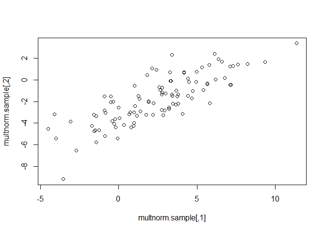

### 2.2 Density of MND

#### Calculating the density of MND

``` r
# Calculate density
multnorm.dens <- dmvnorm(multnorm.sample,
            mean =mu.sim, sigma = sigma.sim)

# Create scatter plot of density heights 
scatterplot3d(cbind(multnorm.sample,multnorm.dens),    
               color="blue", pch="", type = "h",             
                              xlab = "x", ylab = "y", zlab = "density")
```

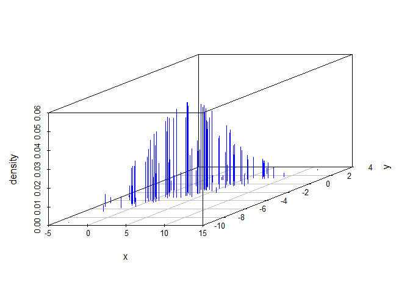

#### Calculating the density over a grid

``` r
# Creating a 40 by 40 grid
mvals <- expand.grid(seq(-5, 10, length.out = 40), seq(-8, 4, length.out = 40))

# Calculate density over the specified grid
mvds <- dmvnorm(as.matrix(mvals),mean=mu.sim, sigma=sigma.sim)
matrix_mvds <-  matrix(mvds, nrow = 40)

# Create a perspective plot
persp(matrix_mvds, theta = 80, phi = 30, expand = 0.6, shade = 0.2, col = "lightblue", xlab = "x", ylab = "y", zlab = "dens")
```

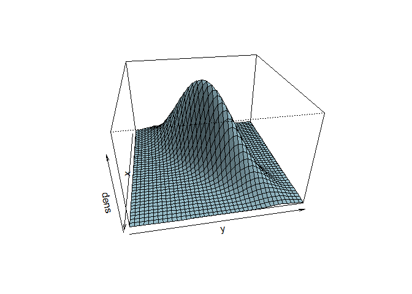

### 2.3 Cumulative Distribution and Inverse CDF

#### Calculate Volume for a biv standard ND and for a biv ND with given Mu, Sigma

``` r
# Volume under a bivariate standard normal
pmvnorm(lower = c(-1,-1), upper = c(1,1))
```

    ## [1] 0.4660649
    ## attr(,"error")
    ## [1] 1e-15
    ## attr(,"msg")
    ## [1] "Normal Completion"

``` r
# Volume under specified mean and variance-covariance matrix
mu.sim <- c(2,-2)
sigma.sim <- matrix (c(9,5,5,4), nrow=2)
pmvnorm(lower=c(-5,5), upper=c(-5,5), mean = mu.sim, sigma = sigma.sim)
```

    ## [1] 0
    ## attr(,"error")
    ## [1] 0
    ## attr(,"msg")
    ## [1] "lower == upper"

#### Calculating probability contours using qmvnorm

``` r
# Probability contours for a standard bivariate normal
qmvnorm(0.9, tail = "both", sigma = diag(2))
```

    ## $quantile
    ## [1] 1.948779
    ## 
    ## $f.quantile
    ## [1] -1.537507e-06
    ## 
    ## attr(,"message")
    ## [1] "Normal Completion"

``` r
# Probability contours for a bivariate normal 
qmvnorm(0.95, tail="both", mean=mu.sim, sigma=sigma.sim)
```

    ## $quantile
    ## [1] 7.110635
    ## 
    ## $f.quantile
    ## [1] 5.712626e-06
    ## 
    ## attr(,"message")
    ## [1] "Normal Completion"

### 2.4 Checking normality of MV data

#### Graphical tests for MV normality

``` r
# We need the package MVN

# Test sample normality
qqnorm(multnorm.sample[,1])
qqline(multnorm.sample[,1])
```


``` r
# Create qqnorm plot 
#uniPlot(wine[,2:5], type = "qqplot")
## Package changed, use other options

# mardiaTest qqplot 
wine.mvntest <- mvn(wine[,2:5], mvnTest="mardia", multivariatePlot = "qq")
```

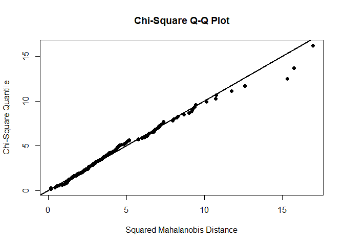

#### Numerical tests for multivariate normality

``` r
# Use mardiaTest
mvn(multnorm.sample, mvnTest="mardia")
```

    ## $multivariateNormality
    ##              Test         Statistic           p value Result
    ## 1 Mardia Skewness  4.50219834700869 0.342286892329864    YES
    ## 2 Mardia Kurtosis 0.172393958020374 0.863127821871863    YES
    ## 3             MVN              <NA>              <NA>    YES
    ## 
    ## $univariateNormality
    ##           Test  Variable Statistic   p value Normality
    ## 1 Shapiro-Wilk  Column1     0.9934    0.9134    YES   
    ## 2 Shapiro-Wilk  Column2     0.9891    0.5943    YES   
    ## 
    ## $Descriptives
    ##     n      Mean  Std.Dev    Median       Min       Max        25th
    ## 1 100  2.398241 3.112652  2.692958 -4.517334 11.350855 -0.02847685
    ## 2 100 -1.785651 2.230358 -1.853192 -9.185953  3.384274 -3.21131313
    ##         75th       Skew    Kurtosis
    ## 1  4.4233138  0.1020264 -0.20676449
    ## 2 -0.1807008 -0.1804888  0.08267562

``` r
# Use hzTest
mvn(wine[, 2:5], mvnTest="hz")
```

    ## $multivariateNormality
    ##            Test       HZ      p value MVN
    ## 1 Henze-Zirkler 2.122978 2.220446e-16  NO
    ## 
    ## $univariateNormality
    ##           Test   Variable Statistic   p value Normality
    ## 1 Shapiro-Wilk  Alcohol      0.9818   0.02       NO    
    ## 2 Shapiro-Wilk   Malic       0.8888  <0.001      NO    
    ## 3 Shapiro-Wilk    Ash        0.9839  0.0387      NO    
    ## 4 Shapiro-Wilk Alcalinity    0.9902  0.2639      YES   
    ## 
    ## $Descriptives
    ##              n      Mean   Std.Dev Median   Min   Max    25th    75th
    ## Alcohol    178 13.000618 0.8118265 13.050 11.03 14.83 12.3625 13.6775
    ## Malic      178  2.336348 1.1171461  1.865  0.74  5.80  1.6025  3.0825
    ## Ash        178  2.366517 0.2743440  2.360  1.36  3.23  2.2100  2.5575
    ## Alcalinity 178 19.494944 3.3395638 19.500 10.60 30.00 17.2000 21.5000
    ##                  Skew   Kurtosis
    ## Alcohol    -0.0506179 -0.8862122
    ## Malic       1.0221946  0.2208517
    ## Ash        -0.1737324  1.0328782
    ## Alcalinity  0.2094697  0.4022708

3 Other MV distributions
------------------------

### 3.1 Other common MV distributions

``` r
# Specify delta and sigma
delta <- c(1, 2, -5) 
sigma <- matrix(c(1, 1, 0, 1, 2, 0, 0, 0, 5), 3, 3)

# Generate samples                  
t.sample <- rmvt(n = 2000, delta = delta, sigma = sigma, df = 4)
```

#### Generate samples from MV t-distribution

``` r
# Generate the t-samples 
multt.sample <- rmvt(200,df=5, delta=mu.sim, sigma=sigma.sim)

# Print the first 6 samples
head(multt.sample)
```

    ##           [,1]         [,2]
    ## [1,]  1.296507 -3.630888843
    ## [2,] -1.194834 -3.150037314
    ## [3,]  6.091285  0.003855692
    ## [4,]  3.911209 -1.786815682
    ## [5,]  4.533806  0.970568770
    ## [6,]  6.722377  1.602526216

``` r
# Check multivariate normality
mvn(multt.sample, mvnTest="mardia", multivariatePlot = "qq")
```


    ## $multivariateNormality
    ##              Test        Statistic              p value Result
    ## 1 Mardia Skewness 51.7419464118513 1.56193332529871e-10     NO
    ## 2 Mardia Kurtosis 12.8233485940948                    0     NO
    ## 3             MVN             <NA>                 <NA>     NO
    ## 
    ## $univariateNormality
    ##           Test  Variable Statistic   p value Normality
    ## 1 Shapiro-Wilk  Column1     0.9599  <0.001      NO    
    ## 2 Shapiro-Wilk  Column2     0.9410  <0.001      NO    
    ## 
    ## $Descriptives
    ##     n      Mean  Std.Dev    Median        Min       Max       25th
    ## 1 200  1.953539 3.645240  1.788258 -14.974307 17.327621 -0.1789746
    ## 2 200 -1.948850 2.305187 -2.049755  -8.999975  9.460375 -3.2847714
    ##         75th      Skew Kurtosis
    ## 1  3.9180451 0.1262332 3.212592
    ## 2 -0.9747879 0.9526393 3.844293

### 3.2 Density and cumulative density for MV-t

``` r
x <- seq(-3, 6, by = 1); y <- seq(-3, 6, by = 1)
d <- expand.grid(x = x, y = x)                   
del1 <- c(1, 2); sig1 <- matrix(c(1, .5, .5, 2), 2)
dens <- dmvt(as.matrix(d), delta = del1, sigma = sig1, df = 10, log = FALSE)
scatterplot3d(cbind(d, dens), type = "h", zlab = "density")
```

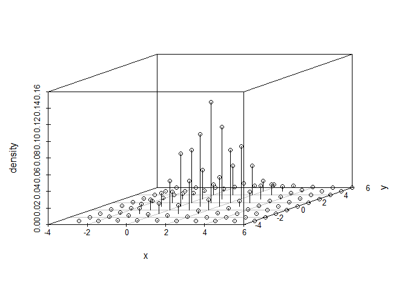

#### Density of MV t-distribution

``` r
# Calculate densities
multt.dens <- dmvt(multt.sample, delta=mu.sim, sigma=sigma.sim, df=5) 

# Plot 3D heights of densities
scatterplot3d(cbind(multt.sample, multt.dens),     
                 color = "blue", pch = "", type = "h",             
                              xlab = "x", ylab = "y", zlab = "density")
```

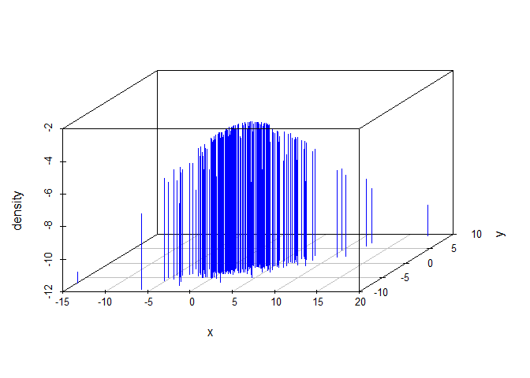

#### Cumulative distributions and quantiles of t

``` r
# Calculate the volume under the specified t-distribution
pmvt(lower=c(-5,-5), upper=c(5,5), df=5, delta=mu.sim, sigma=sigma.sim)
```

    ## [1] 0.6628607
    ## attr(,"error")
    ## [1] 0.0008002231
    ## attr(,"msg")
    ## [1] "Normal Completion"

``` r
# Calculate the equal probability contour
qmvt(0.90, tail="both", df=5, delta=mu.sim, sigma=diag(2))
```

    ## $quantile
    ## [1] 4.998444
    ## 
    ## $f.quantile
    ## [1] -1.733438e-07
    ## 
    ## attr(,"message")
    ## [1] "Normal Completion"

### 3.3 Multivariate skewed distributions

#### Drawing samples from skew distributions

``` r
# Preloading the parameters
mu.sim <- c(2,-2)
sigma.sim <- matrix(c(9,5,5,4), 2, 2)

# Generate the skew-normal samples 
skewnorm.sample <- rmsn(100, xi=mu.sim, Omega=sigma.sim, alpha=c(4,-4)) 
colnames(skewnorm.sample) <- c("x1","x2")
    
# Print first six samples
head(skewnorm.sample)
```

    ##              x1        x2
    ## [1,]  4.7278400 -1.854951
    ## [2,] -5.1360347 -6.859828
    ## [3,]  6.1902245 -2.166066
    ## [4,]  3.5437474 -1.617492
    ## [5,]  0.3170299 -4.208416
    ## [6,]  2.8296218 -1.971933

``` r
# Generate the skew-t samples 
skewt.sample <- rmst(n = 100, xi = mu.sim, Omega = sigma.sim, alpha = c(4, -4), nu=5)


# Print first six samples
head(skewt.sample)
```

    ##          [,1]       [,2]
    ## [1,] 9.233234 -0.3960368
    ## [2,] 4.409762 -1.0343672
    ## [3,] 4.756114 -0.2903418
    ## [4,] 5.658298 -1.3595251
    ## [5,] 3.376499 -2.1516667
    ## [6,] 1.041633 -3.0191202

#### Plotting and testing of skewed-densities

``` r
# Contour plot for skew-normal sample
gg <- ggplot(data=as.data.frame(skewnorm.sample), aes(x=x1,y=x2)) + geom_point() + geom_density_2d()
gg
```

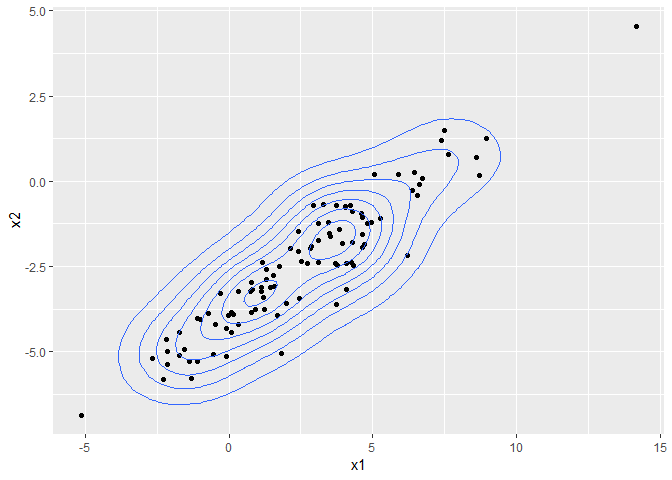

``` r
# Normality test for skew-normal sample
skewnorm.Test <- mvn(skewnorm.sample, mvnTest="mardia", multivariatePlot = "qq")
```

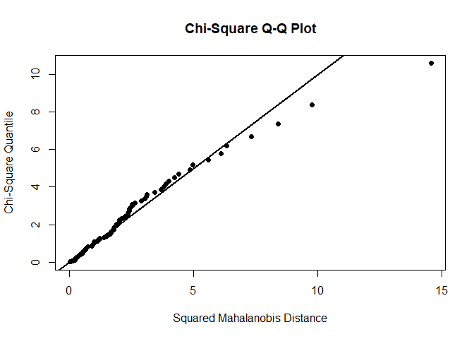

``` r
# Normality test for skew-t sample
skewt.Test <- mvn(skewt.sample, mvnTest="mardia", multivariatePlot = "qq")
```

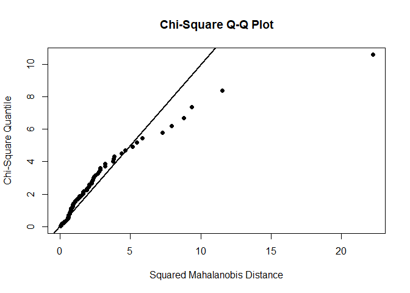

#### Parameter estimation for MV skew-normals

``` r
# Splitting the data set
ais.female <- ais[ais$sex=="female",]
ais.male <- ais[ais$sex=="male",]

# Fit skew-normal parameters
fit.ais <- msn.mle(y = cbind(ais.female$Ht, ais.female$Wt), opt.method = "BFGS")

# Print the skewness parameters
fit.ais$dp$alpha
```

    ## [1] -1.292446 -1.000158

4 Principal Component Analysis
------------------------------

### 4.1 Performing PCA

#### Using the princomp function

``` r
# Calculate PCs
pca.state <- princomp(state.x77, cor=TRUE, scores=TRUE) 

# Plot the PCA object  
plot(pca.state) 
```

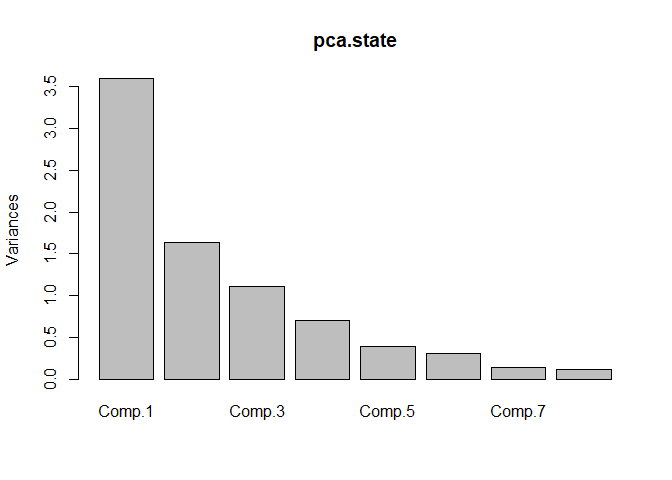

``` r
# Print the summary of the PCs
summary(pca.state)  
```

    ## Importance of components:
    ##                           Comp.1    Comp.2    Comp.3     Comp.4     Comp.5
    ## Standard deviation     1.8970755 1.2774659 1.0544862 0.84113269 0.62019488
    ## Proportion of Variance 0.4498619 0.2039899 0.1389926 0.08843803 0.04808021
    ## Cumulative Proportion  0.4498619 0.6538519 0.7928445 0.88128252 0.92936273
    ##                            Comp.6    Comp.7     Comp.8
    ## Standard deviation     0.55449226 0.3800642 0.33643379
    ## Proportion of Variance 0.03843271 0.0180561 0.01414846
    ## Cumulative Proportion  0.96779544 0.9858515 1.00000000

#### Calculating the POV explained & Choosing the number of PCs

``` r
# Variance explained by each PC
pca.var <- pca.state$sdev^2  

# Proportion of variance explained by each PC
pca.pvar <- pca.var/sum(pca.var) 

# Proportion of variance explained by each principal component
pca.pvar
```

    ##     Comp.1     Comp.2     Comp.3     Comp.4     Comp.5     Comp.6 
    ## 0.44986195 0.20398990 0.13899264 0.08843803 0.04808021 0.03843271 
    ##     Comp.7     Comp.8 
    ## 0.01805610 0.01414846

``` r
# Cumulative variance explained plot
plot(cumsum(pca.pvar), xlab = "Principal component", ylab = "Cumulative Proportion of variance explained", ylim = c(0,1), type = 'b')
grid()

# Add a horizontal line
abline(h=0.95, col="blue")
```

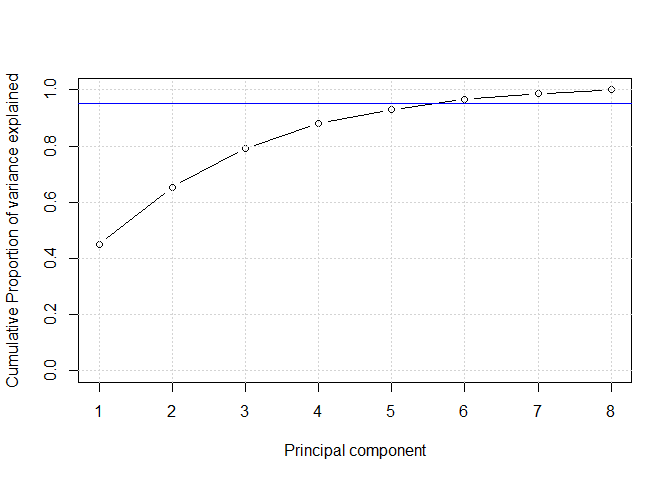

``` r
# Alternatively: Choosing the number of PCs using scree plot
stats::screeplot(pca.state, type = "l")
grid()
```

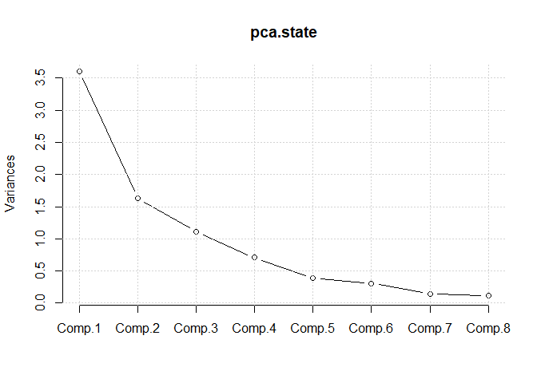

### 4.2 Interpreting PCA attributes

#### Loadings and scores for the PCs using ggplot2

``` r
# Create dataframe of scores
scores.state <- data.frame(pca.state$scores)

# Have to import:
state.region <- c("Southeast","West","West","Southeast","West","West","Northeast","Southeast",
                  "Southeast","Southeast","West","West","Northcentral","Northcentral",
                  "Northcentral","Northcentral","Southeast","Southeast","Northeast","Southeast",
                  "Northeast", "Northcentral","Northcentral","Southeast","Northcentral","West",
                  "Northcentral","West","Northeast","Northeast","West","Northeast","Southeast",
                  "Northcentral","Northcentral","Southeast","West","Northeast","Northeast",
                  "Southeast","Northcentral","Southeast","Southeast","West","Northeast","Southeast",
                  "West","Southeast","Northcentral","West")

# Plot of scores labeled by state name (showing only the 1st and 2nd component)
ggplot(data = scores.state, aes(x = Comp.1, y = Comp.2, label = rownames(scores.state), color=state.region)) + 
    geom_text(alpha=0.8, size = 3) + 
    ggtitle("PCA of states data")
```

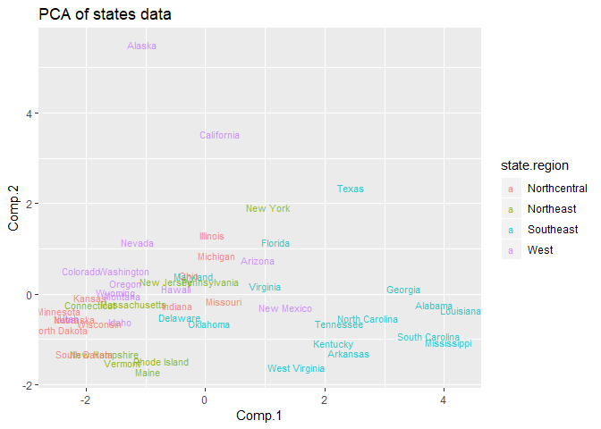

#### Visualizing PCA using the factoextra library

``` r
#Plot the first two components
pca.score <- pca.state$scores
fviz_pca_ind(pca.state)
```

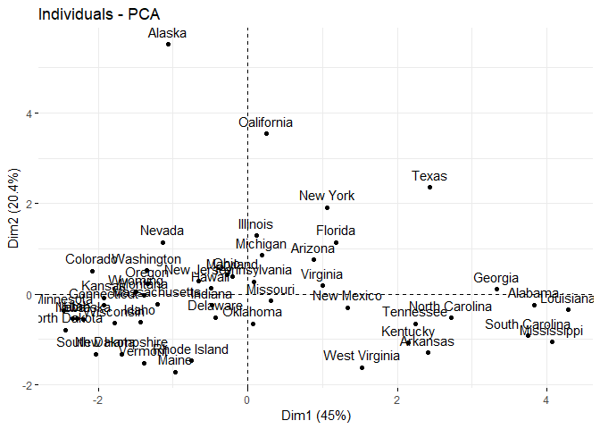

``` r
# Plot the PC loadings
#fviz_pca_var(pca.state)
# Create a biplot
#fviz_pca_biplot(pca.state)
```

### 4.3 Multi-dimensional scaling

#### MDS in two and three dimensions

``` r
## MDS in 2D
# Calculate distance 
state.dist <- dist(state.x77)

# Perform multidimensional scaling 
mds.state <- cmdscale(state.dist,k=2) 

# Change mds.state to a dataframe for use in ggplot
mds.state_df <- data.frame(mds.state)

# Plot the representation of the data in two dimensions 
ggplot(data = mds.state_df, aes(x = X1, y = X2, label = rownames(mds.state), color = state.region)) + 
    geom_text(alpha = 0.8, size = 3) 
```

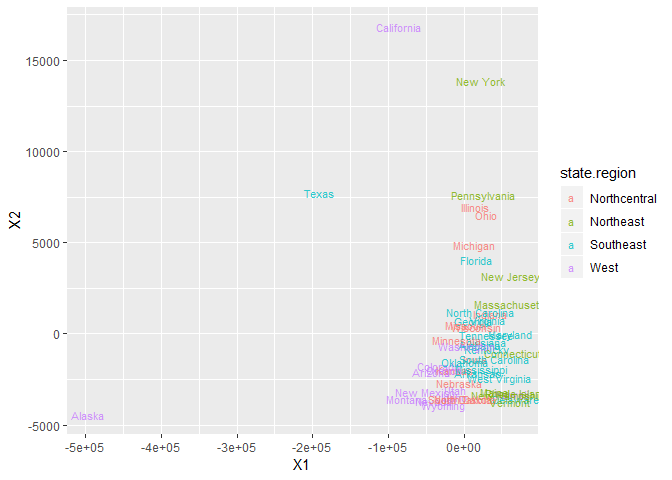

``` r
## MDS in 3D
# Calculate distance 
wine.dist <- dist(wine[,-1])

# Perform multidimensional scaling 
mds.wine <- cmdscale(wine.dist, k=3) 
mds.wine_df <- data.frame(mds.wine)

# Plot the representation of the data in three dimensions 
scatterplot3d(mds.wine_df, color = wine$Type, pch = 19, type = "h", lty.hplot = 2)
```

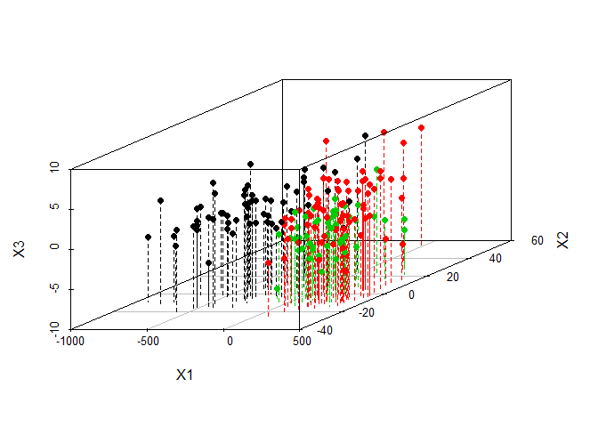
